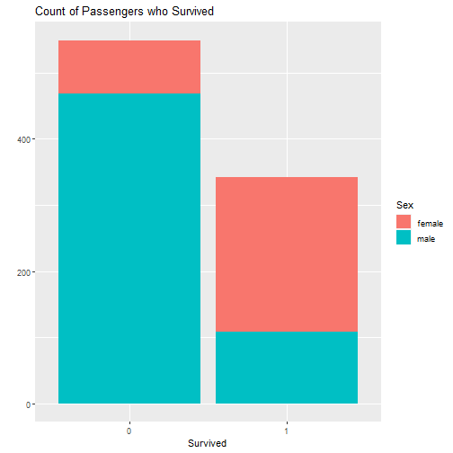

Would I Die?
=======================================================
author: Mariah Birgen
date: April 10, 2020
autosize: true

Remember the Titanic?
========================================================

This app is designed to identify things about you that would predict whether or not you would survive the sinking of the Titanic.

- Passenger Class
- Sex

Data
========================================================
Passenger data was loaded using the package *titanic*.

```
    Survived          Pclass          Sex           Age       
 Min.   :0.0000   Min.   :1.000   female:314   Min.   : 0.42  
 1st Qu.:0.0000   1st Qu.:2.000   male  :577   1st Qu.:20.12  
 Median :0.0000   Median :3.000                Median :28.00  
 Mean   :0.3838   Mean   :2.309                Mean   :29.70  
 3rd Qu.:1.0000   3rd Qu.:3.000                3rd Qu.:38.00  
 Max.   :1.0000   Max.   :3.000                Max.   :80.00  
                                               NA's   :177    
```


App Behavior
========================================================
The app allows you to break down the survival data based on the cabin class that the passenger purchased. You select the appropriate cabin class and it automatically gives you a graph of survival as well as a survival percentage.

Survival Predictors
========================================================




In this plot, $$Survived = 1$$ means the passenger survived the sinking of the ship.

Future Work
=====================================================
A future improvement of the app would be to include the age of the passenger as well as the class for analysis.
